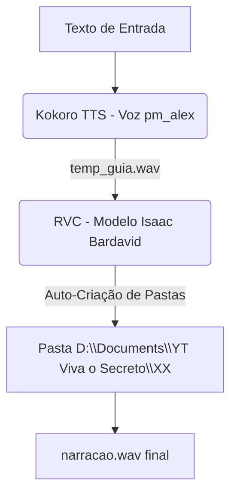

# Gerador de Narração Inteligente (Kokoro TTS + RVC)

Este projeto automatiza o processo de criação de narrações profissionais em alta qualidade utilizando inteligência artificial. O pipeline funciona em duas etapas principais:
1. **TTS (Text-To-Speech) com Kokoro:** Gera uma voz guia limpa e com pronúncia nativa de Português do Brasil.
2. **RVC (Retrieval-based Voice Conversion):** Converte a voz guia para o timbre personalizado do dublador **Isaac Bardavid**.

---

## 🚀 Como Funciona



---

## 🛠️ Requisitos e Instalação

Certifique-se de ter o Python 3.10+ instalado e execute a instalação das dependências:

```powershell
pip install kokoro soundfile numpy scipy rvc-python torch
```

> [!NOTE]
> O script conta com um **patch interno para o PyTorch 2.6+**. Isso resolve o erro padrão de segurança do `torch.load` (`weights_only=True`), permitindo carregar o modelo HuBERT e o modelo RVC sem falhas.

---

Toda a configuração é feita diretamente no início do arquivo `gerar_narracao_isaac.py`.

---

## 📁 Estrutura do Projeto

Os arquivos do projeto estão organizados da seguinte forma dentro do repositório `C:\Users\Usuario\tts-rvc`:

```text
tts-rvc/
├── Voice Models/           # Pasta contendo os pesos e índices dos modelos RVC
│   └── ISAAC BARDAVID - Weights Model/
│       ├── isaac_bardavid_model.pth
│       └── isaac_bardavid_model.index
├── gerar_audio.py          # Script básico de geração de áudio com Kokoro TTS
├── gerar_narracao.py       # Script de pipeline alternativo (Edge-TTS + RVC)
├── gerar_narracao_isaac.py # Script de pipeline principal (Kokoro TTS + RVC)
├── tutorial-de-criacao.md  # Tutorial com o passo a passo da construção do pipeline
└── README.md               # Documentação do projeto
```

---

## ⚙️ Configuração e Uso

### 1. Alterar o Texto da Narração
Edite a variável `TEXTO` com a mensagem que deseja narrar:
```python
TEXTO = """
Seu texto aqui...
"""
```

### 2. Alterar a Pasta de Destino
Para organizar seus vídeos por números (`01`, `02`, `03`...), altere a variável `PASTA_NUMERO`. O script criará a pasta de destino automaticamente se ela não existir.
```python
BASE_DIR = r"D:\Documents\YT Viva o Secreto"
PASTA_NUMERO = "01"  # Altere para "02", "03", etc. para o próximo vídeo
NOME_ARQUIVO = "narracao.wav"
```

### 3. Execução
No terminal, execute o script:
```powershell
python gerar_narracao_isaac.py
```

O áudio convertido será gerado diretamente na pasta configurada:
`D:\Documents\YT Viva o Secreto\<PASTA_NUMERO>\narracao.wav`
